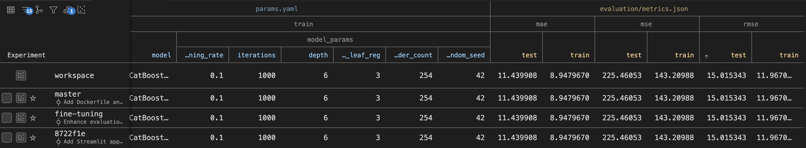
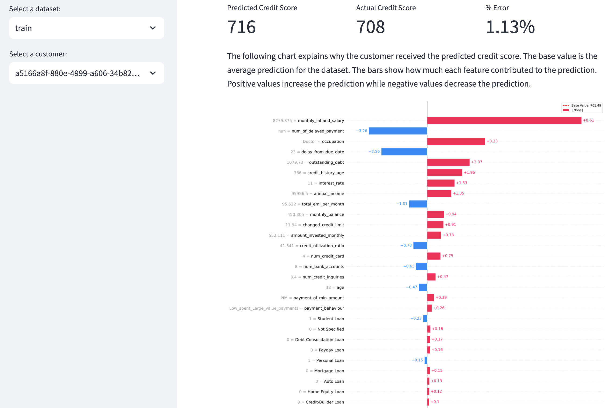

# Zilch - Senior Data Scientist Technical Task

This repository contains submission code and data for the Zilch Senior Data Scientist technical task for Joseph Iles.

## How to read this repository

I have have attempted to demonstrate my knowledge in MLOps principles as much as possible. Because of this, much of the "production code" sits outside of notebooks and is executed using Data Version Control (DVC). However, there are two exploratory notebooks inside of `notebooks/`.

The starting point for understanding my process is the `feature_eda.ipynb` notebook. In here, I have explored each feature one-by-one in order to check for data issues, explore the relationship of features to the outcome variable and begin to develop some production transformation code. I then productionise these transformations in `zilch_interview/prepare.py`.

The `zilch_interview/` directory is the development package for this repository, managed using Poetry. All code across notebooks and python files should execute correctly assuming that this local module is installed correctly. Files in this directory also each contain a `main()` function, which defines how the script should be executed as part of the DVC pipeline.

The second notebook `catboost.ipynb` is an initial exploration into training a model with Catboost and getting SHAP values for explanations. This code is productionised in `zilch_interview/train.py`.

`dvc.yaml` defines the pipeline steps and any parameters that are passed to the pipeline, such as model hyperparameters. I used DVC to perform some basic hyperparameter tuning via grid search. I have provided a screenshot below demonstrating how the output from this looks in VC Code. The optimal hyperparameters are contained in `params.yaml`. `zilch_interview/evaluate.py` defines the code for evaluating the pipeline in terms of some common regression metrics and logging to DVC.



Finally, I have written a simple Streamit app. In it, the user can choose one of the three datasets and an individual customer from each to inspect the model prediction. For the train and test datasets, the diff between the actual and predicted values are also shown. The app also shows a SHAP bar chart which explains exactly why a given customer gets the score they are given. You can run the app yourself by building and running the Dockerfile, as I outline below.



## Running the DVC pipeline

To install DVC and run the pipeline, follow these steps:

1. Install DVC:

   ```sh
   pip install dvc
   ```

2. Run the DVC pipeline:
   ```sh
   dvc repro
   ```

This will execute the pipeline defined in `dvc.yaml` and use the parameters from `params.yaml`. Installing the DVC extension for VS Code will allow you to inspect the evaluation metrics for different pipeline configurations.

## Building and Running the Dockerfile

To build and run the Dockerfile, follow these steps:

1. Build the Docker image:

   ```sh
   docker build -t zilch_interview .
   ```

2. Run the Docker container:
   ```sh
   docker run -d -p 8501:8501 zilch_interview
   ```

This will start the application and make it accessible at `http://localhost:8501`.
